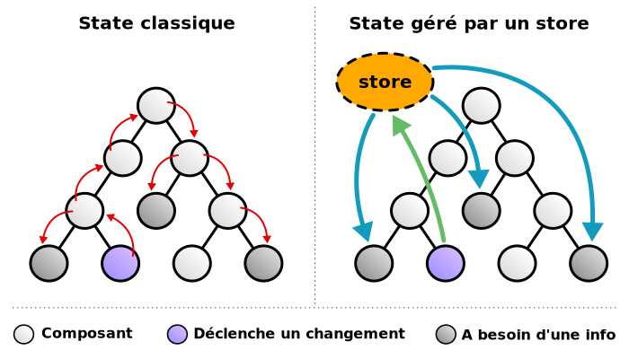
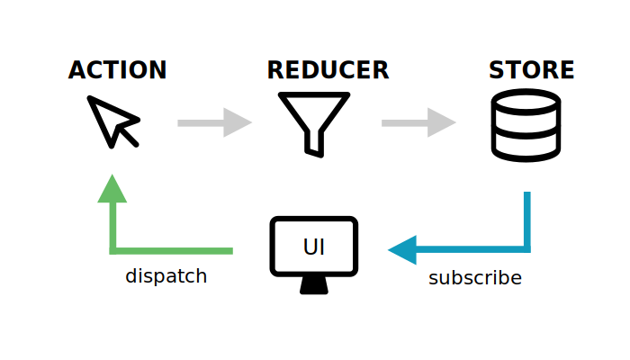

# Discover Redux

The app is up and running **[--> HERE <--](http://ns3251440.ip-87-98-217.eu/agathe-pons/gradient_app_react_redux/dist/)**.

## Comprendre le store

- store
- state
- dispatch
- subscribe (pour du JS vanilla)



## Identifier les composants

- store
- actions
- reducer



## UseSelector

## Pseudo code

### 1er approche

```js
function useSelector(cbSelection){
    const state = storeFromProvider.getState();
    // il récupère le store donné au Provider (qui englobe notre application)

    const [oldStateSlice, setOldStateSlice] = useState(null);

    const stateSlice = cbSelection(state);

    // il fait une comparaison simple avec l'ancienne valeur
    if(oldStateSlice !== stateSlice){
        // si c'est différent il re-render
        render(); // pseudo code, pour declencher le render de l'application
    }

    return stateSlice;
}
```

### 2eme approche

```js
function useSelector(cbSelection){
    const [oldStateSlice, setOldStateSlice] = useState(null);

    storeFromProvider.subscribe(() => {
        const state = storeFromProvider.getState();
        // il récupère le store donné au Provider (qui englobe notre application)

        const stateSlice = cbSelection(state);

        // il fait une comparaison simple avec l'ancienne valeur
        if(oldStateSlice !== stateSlice){
            // si c'est différent il met à jour l'ancienne valeur avec la nouvelle valeur
            //  du coup, faire un setState déclenche un re-render
            setOldStateSlice(stateSlice);
        }
    });

    return oldStateSlice;
}
```

```js
// récupérer les données
const stateFromStore = store.getState();
console.log('store.getState() =>', stateFromStore);

// envoyer une demande de modication
// cette demande de modification (action), a toujours un prenom (type), ce prénom décrit ce que l'on veut modifier
const monAction = { type: 'ADD_TO_COUNTER' };
store.dispatch(monAction);

// on re-récupère les données après les avoir modifiées
const newStateFromStore = store.getState();
console.log('store.getState() =>', newStateFromStore);
```

```js
import { createStore } from 'redux';

const initialState = {
  counter: 0,
};

// la fonction de reducer permet de décrire comment les données du store redux vont évoluer
// le reducer fait la mise à jour des données du store
// cette fonction prend le state en paramètre
// et elle doit retourner le nouveau state
function monReducer(state = initialState, action = {}) {
  console.log('monReducer => ', { state, action });

  if (action.type === 'ADD_TO_COUNTER') {
    // ATTENTION - ON NE DOIT PAS DIRECTMENT MODIFIER LE STATE
    // c'est comme dans les composants, on ne doit pas modifier le state
    // state.counter += 1;

    // on est obligé de retourner la nouvelle valeur
    return {
      counter: state.counter + 1,
    };
  }

  // on retourne le nouveau state
  return state;
}

const store = createStore(monReducer);

export default store;
```

## Résultat


